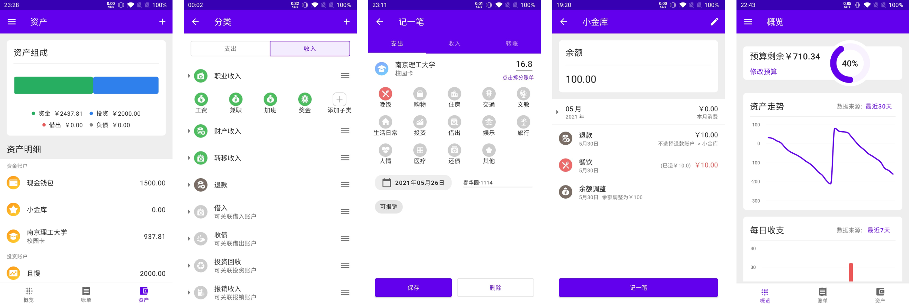

# small-steps
该项目为本科毕业设计项目，模仿网易有钱设计了一个安卓端的记账 App。

底层采用了复式记账的思想，可以看 [Accounting for Computer Scientists](https://martin.kleppmann.com/2011/03/07/accounting-for-computer-scientists.html)，
其中心思想是将资金的流向通过图这种数据结构表现出来。

原型设计使用 Figma，[项目链接](https://www.figma.com/file/VAVygTUFEfj0mFnuc7ZTEe/Steps)。

实现了对于南京理工大学校内账单的爬取。

[答辩文件](files/毕设答辩.pptx)
